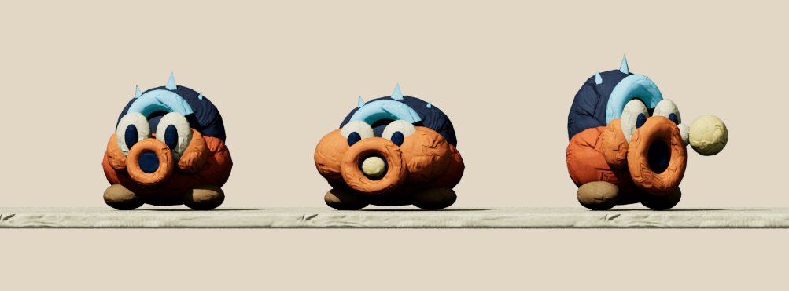
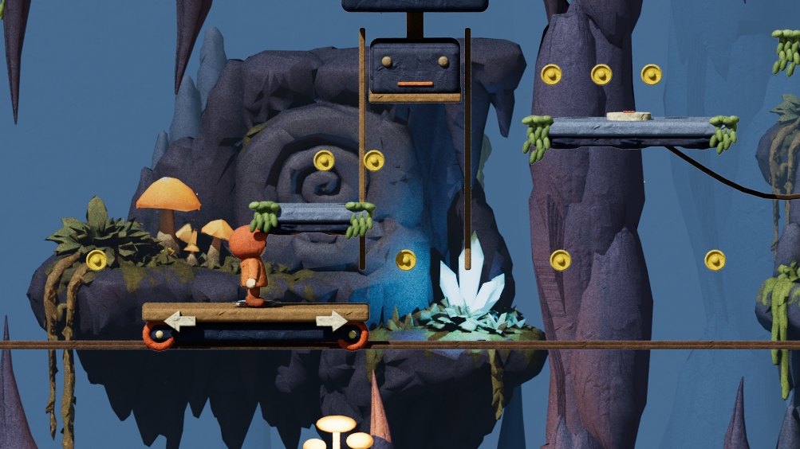
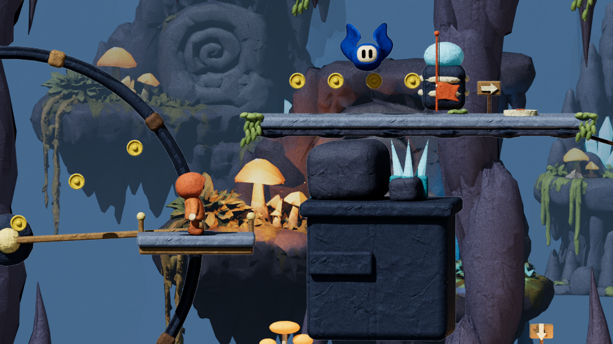
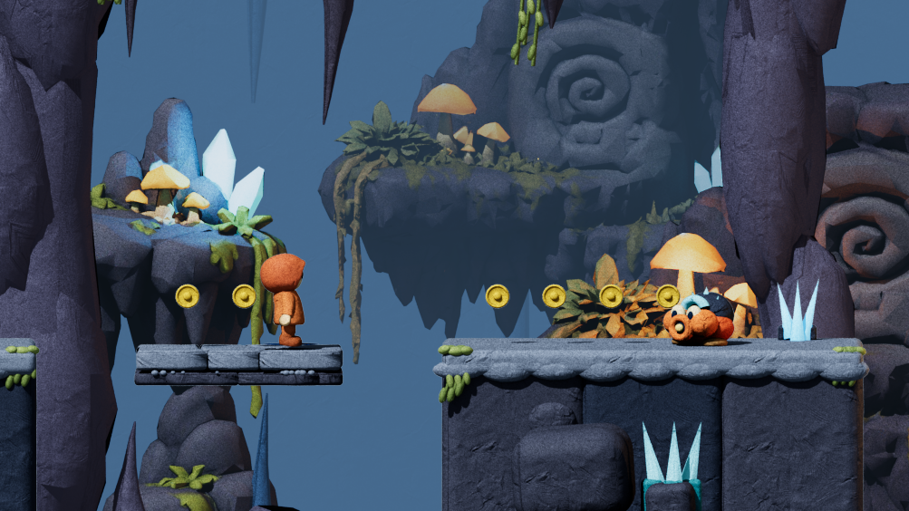

# Ember Caverns — wake the mountain

The route keeps its 289.5-unit horizontal footprint but folds the journey through rooms. Four relays change routes the player has already seen. Solid grates make the first three returns necessary; the final relay provides a forgiving bridge into the finale. Solved relays stay solved through falls and checkpoint saves.

| Room | Player decision | Return or reward |
| --- | --- | --- |
| Echo Switchback | Follow the cable uphill, double back across the upper shelves, press the relay. | Descend the opposite side to the now-open ground passage. A left-hand alcove hides the first flower. |
| Furnace Ferry | Shift weight to drive or reverse; centre yourself to brake before an alternating press. | Leave the ferry for an upper loft, find a flower, and pause both presses. The upper route is a useful shortcut. An empty ferry returns to its starting dock. |
| Turning Heart | Board a circulating cradle and ride its arc to the high balcony. | Unlock the floor grate, then descend separate shelves. The lower catch shelf returns to the boarding ledge after a missed transfer. |
| Sunken Relay | Drop through a thin hatch to reach the relay beneath the main route. | A repeating lift returns to the upper exit. Double back along the high left branch for the third flower. |
| Spitters’ Gallery | Read a mouth charge, shelter behind stone, then time a jump across a brittle shelf. | Closing the distance lets you stomp the shooter for a bounce. |
| Last Light | Climb a short reversed staircase and wake the last bridge. | Descend through a pulse platform into the bell chamber. |

## Enemy sketch: Echo Spitter

A low orange clay body, little feet, a slate shell with a curled cyan ridge, and three blunt crystal points. Cream eyes sit above a puckered nozzle. Its silhouette reads as a grounded creature, distinct from the airborne blue bat and the green forest enemy. It uses the existing clay material and purpose-built 3D geometry; no missing model is required.

| Beat | Cue and behaviour | Counterplay |
| --- | --- | --- |
| Watch | Faces a nearby player with a clear line of sight. | Stone cover prevents acquisition. |
| Charge | Cheeks swell and a warm clay seed fills the mouth for 0.9 seconds. The shot direction is already locked. | Move or prepare to jump; the projectile never homes. |
| Fire | Recoil and a short sound accompany a gold pellet with a cream clay tail. | Jump over it or place solid scenery between it and the player. |
| Recover | The body settles before its next shot. | Approach and stomp at any point in the cycle for a bounce and a small clay burst. |

Shots use swept collision against both moving players and cover. The pool is capped at 16 even in edited levels. Pausing freezes shots and wind-ups; respawning clears shots. Defeated spitters stay defeated during the current attempt.

## Iteration notes

- Moved a recovery shelf clear of a solid wall and shortened a flower approach after traversal checks exposed bad landings.
- Added a walkable return from the sunken switch before boarding its lift, making missed lift cycles recoverable.
- Gave the press ferry an explicit impact floor and placed its upper niche outside the head's stroke.
- Changed the final pulse transfer to a deliberate jump, so the descent has enough airtime.
- Kept hints to the new controls and route-changing systems. Direction posts remain attached to their supporting shelves.

## Verification

`LEVEL=2 node tests/playthroughs.mjs` completes the main route. `LEVEL=2 FLOWERS=1 node tests/playthroughs.mjs` completes a second route with all three flowers. Both record and replay normal movement inputs with enemies, gates and presses active, without position resets or edits to game state. These runs verify feasibility, not human enjoyment or mobile responsiveness.

`tests/cavern-redesign.mjs` checks blocking grates and saved relay state, ferry steering/braking/recall, a full orbit with passenger carry, projectile warnings/dodges/cover/damage, stomp defeat, pause/respawn, and editor export/import. The wider check suite also covers the existing three chapters.

These are offline renders of actual scene geometry and materials. Exact WebGL appearance and real-phone feel remain unverified.

The cavern layout version is now 4. Previous cavern checkpoint positions and records are incompatible with the new route; other chapters keep their layouts and progress.
