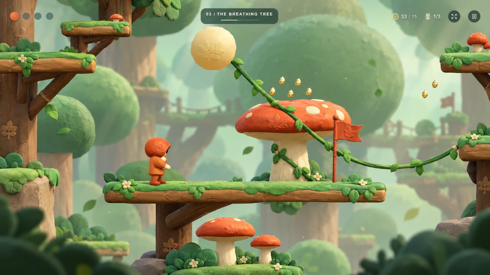
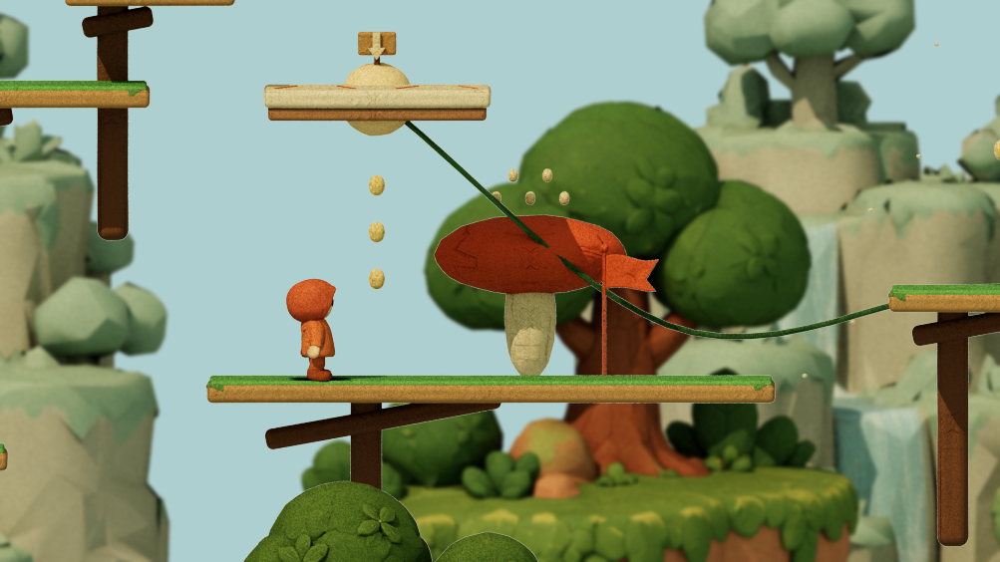
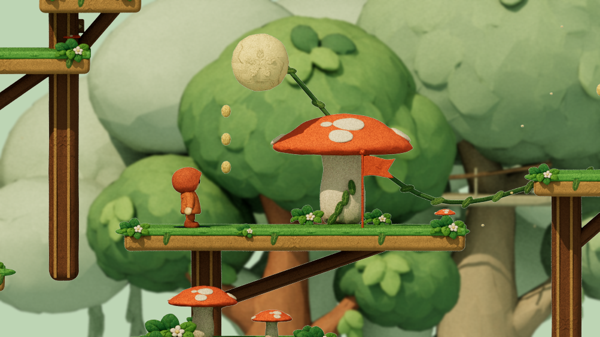
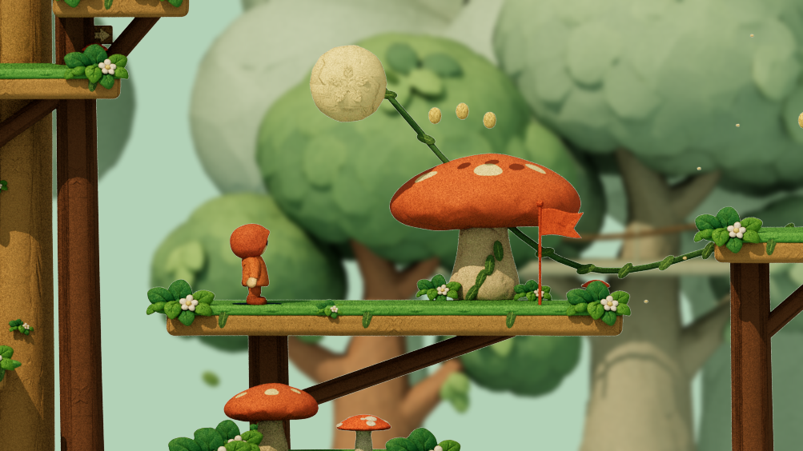
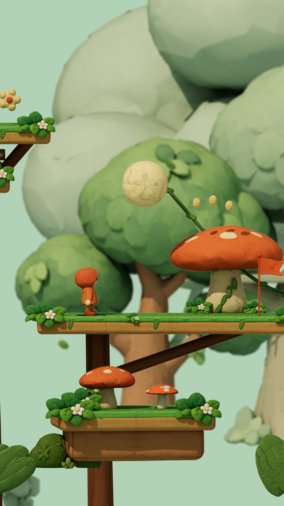

# Wildwood — the Breathing Tree

The September 10 reference is translated into the playable forest's actual
geometry. The broad central deck, giant scarlet mushroom, suspended golden seed,
leafy descending vine, upper tree ledges and lower mushroom shelf follow its
composition. Warm wood and irregular moss frame the foreground; supplied tree
crowns, distant ropeways and mint fog establish depth. The treatment also extends
to the chapter's other branches, spring mushrooms and spore landmarks.

## Visual iteration

| Pass | Finding and response |
|---|---|
| Baseline | Thin branches, a primitive mushroom and floating cliff islands did not match the target. |
| 1 | Added supplied flowers, trees and mushrooms, thick mossy branches and the golden seed; the first canopy was too dense and the mushroom too pointed. |
| 2 | Opened background spacing, strengthened haze, broadened the small cap, and corrected a circuit-lamp scale error that looked like a second seed. |
| 3 | Used the rounded Claycap model for the main mushroom, after reducing its three-million-triangle mesh. Moved the checkpoint flag and arranged beads above the cap. |
| 4 | Added the large framing trunk and lower foliage, and refined the mushroom's cream spots. |
| 5 | Baked cream pigment into the cap's existing UV surface, avoiding separate spot meshes. Extended supporting trunks below the view instead of leaving cut ends in midair. |
| 6 | Filled the tall portrait view with larger distant crowns, retained the original collectible count/IDs, and removed floating mechanical outlets from organic spore currents. |

The upper climb and the state after breaking the seed were reviewed separately.
The last landscape and portrait captures below show the shipping scene geometry.
They omit the HUD and use an offline approximation of the lighting, fog and blur.
They are **not WebGL screenshots**. Live device rendering, touch feel and frame
rate remain unverified. Small cast shadows from the airborne beads are present
in the offline review; the cream cap markings themselves are baked pigment.

### Target



### Before



### Intermediate comparison



### Final landscape



### Final portrait



## Models and material detail

| Supplied model | Use | Shipping geometry |
|---|---|---:|
| Claycap Mushroom 0910095608 | Rounded hero cap, large mushroom landmarks and spring caps | 30,272 triangles, simplified from 3,027,364 |
| Spotted Scarlet Mushroom 0910095602 | Small mushrooms on branches and lower shelves | 10,422 triangles; cap compressed, stalk lengthened/narrowed |
| Clay Canopy 0910095554 | Near and middle background trees; rooted tree landmarks | 10,464 triangles, unchanged |
| Clay Canopy 0910095548 | Larger distant tree crowns | 10,442 triangles, unchanged |
| Clay Garden Bloom 0910095541 | Flowering leaf clusters, ledge edges and mushroom bases | 10,428 triangles, unchanged |

The five shipped files total **4,440,736 bytes**. All retain embedded color, normal
and roughness maps, repacked to 1024 pixels. Mushroom pigment is warmed toward
scarlet/cream. The rounded mushroom receives cream spots directly in its color
map; its source dents and normal map remain. Existing clay relief is also applied
through the game's shared material path. Uploaded originals are untouched.

`dist/assets/breathing-tree-assets.json` records source/shipped hashes, sizes,
triangle counts and adaptations. Assets load when entering the forest and share
geometry/materials through streaming and editor rebuilds. No extra decoder is
required. Model preparation and UV sampling happen offline, never in a frame.

To reproduce the heavy-mesh reduction, use glTF Transform CLI **4.5.0**:

```sh
gltf-transform simplify '<uploads>/Meshy_AI_Claycap_Mushroom_0910095608_texture(1).glb' /tmp/claycap-simplified.glb --ratio 0.01 --error 0.001
python scripts/prepare-breathing-tree.py '<uploads>' /tmp/claycap-simplified.glb
```

## Gameplay and editor behavior

The golden seed replaces `tree-seal`, moving its actual breakable surface to
x=119.15, width=1.7, top=19.75. A stomp breaks the seed and releases the existing
`tree-spores` current. The attached vine then disappears; travelling light beads
continue to indicate the released current. The route still completes using the
normal controls. No invisible four-unit seal is left behind.

The central checkpoint moves from x=123 to x=124.2, and its flag sits in front of
the mushroom. Three existing beads are arranged above the cap. Their IDs, total
chapter count of 75, three secret flowers and route endpoint are retained. The
seal's wooden direction sign moves onto `tree-top`, where it is grounded.
Existing saves retain their IDs; local edited layouts are not overwritten.

Decorative mushrooms remain behind the play plane. Spring mushrooms are aligned
to the original collision top and width. Breathing scale and drifting leaves use
simulation time, pause with play and stop under reduced motion. Foreground
scenery retains clearance fading and is hidden while editing.

## Verification

- All 207 main, optional and recovery crossings pass real-physics reachability.
- All four complete automated playthroughs pass without resets or state edits.
- Existing movement, joystick, fullscreen, player/enemy animation, audio,
  completion, save, editor and DOM integration checks pass.
- New scene assertions verify spring-cap contact, seed collision bounds,
  released-vine state, checkpoint restoration, pause/reduced motion and tree
  coverage through portrait/landscape climbs.
- Scene checks retain shared resources through chapter changes and editor
  rebuilds; forest streaming stays bounded at 14 platforms, 46 scene entries and
  198 cached clay shapes in the existing forward/backward traversal scenario.
- All five GLBs pass embedded-map, hash, triangle-count and format checks.

Run `npm ci` followed by `npm run check`. To reproduce scene comparisons with
Mitsuba, NumPy and Pillow installed:

```sh
REVIEW_LEVEL=1 node scripts/export-citadel-scene.mjs /tmp/forest-review 118 14
python scripts/render-citadel-review.py /tmp/forest-review /tmp/forest-review.png
REVIEW_LEVEL=1 REVIEW_WIDTH=941 REVIEW_HEIGHT=1672 node scripts/export-citadel-scene.mjs /tmp/forest-portrait 118 14
REVIEW_LEVEL=1 REVIEW_BROKEN=tree-seal node scripts/export-citadel-scene.mjs /tmp/forest-open 129 15.6
```
