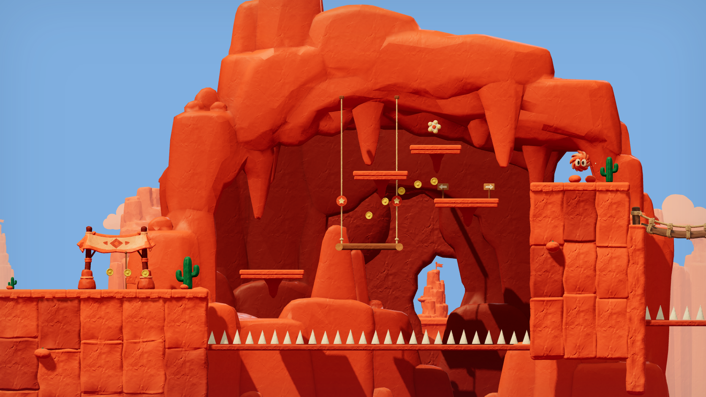

# Inside the Great Arch

The canyon’s lift room now sits inside the supplied sandstone cave: a broad overhang and hanging rock points frame the route, shaded rock folds close the back of the chamber, and small apertures look out onto the canyon. The four ledges have tapered sandstone supports. The lift ropes end at ceiling sockets and change length as the platform moves.

The original route, collision surfaces, moving-platform timing, flower detour, spikes, checkpoints and enemy placements are retained. The enclosure streams with the section, follows its banks on editor rebuild, and remains behind the play lane. Other chapters reuse the retained asset without displaying this chamber.

## Asset

Source: user-supplied `Meshy_AI_Desert_Cave_Arch_0913091257_texture.glb`. No new model generation or external asset download was used. The original file remains untouched.

- 10,440 triangles; all source geometry, normal and UV buffers preserved.
- 5,031,236 source bytes → 1,119,600 shipped bytes.
- Original colour map retained at 2048²; normal and roughness maps repacked at 1024².
- The runtime fits the sculpture to the chamber’s width and compresses its depth behind the play lane. Vertex colours add cavity shade without modifying source positions or UVs.
- [Asset manifest](../../dist/assets/canyon-cave.json) and [independent byte/hash checks](asset-checks.json).

Reproduce the texture repack with `python3 scripts/prepare-canyon-cave.py PATH_TO_SOURCE_GLB`.

## Verification

All 28 project check groups pass: [27 groups](checks.txt) plus the extended [scene checks](scene-checks.txt). The scene checks cover the real model and all three material maps, clear depth placement, stable rope endpoints throughout lift travel, streaming out/back, editor rebuild/movement and chapter return without disposing shared assets.

All four chapter main routes finish in simulation without resets or state edits: [main playthroughs](main-playthrough.json). The canyon also completes with all three flowers: [flower playthrough](flower-playthrough.json).

Actual Chrome/WebGL review covers [desktop gameplay](gameplay-desktop.png), [portrait gameplay](gameplay-portrait.png) and the [level editor](editor.png). A six-second lift ride retains all health with no deaths. Editor shelf resizing, undo and enclosure retention pass. No page errors or failed HTTP asset requests: [browser results](browser-results.json).

Composition captures use fixed review positions; complete route runs are simulation checks. Render counters are snapshots, not performance benchmarks. Run `node scripts/review-great-arch.cjs` with the local game server on port 5173 to refresh browser evidence.

Implementation: [room assembly](../../dist/great-arch.js), [asset loader](../../dist/canyon-assets.js), [streaming](../../dist/streaming.js), [lift construction](../../dist/canyon.js), [render updates](../../dist/world.js).
