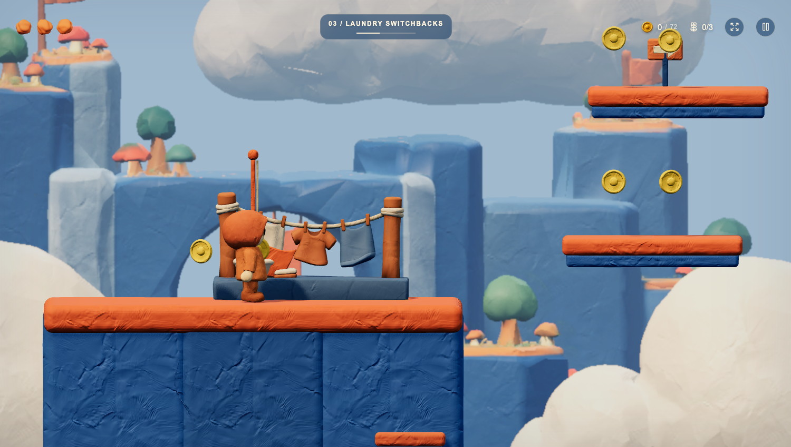
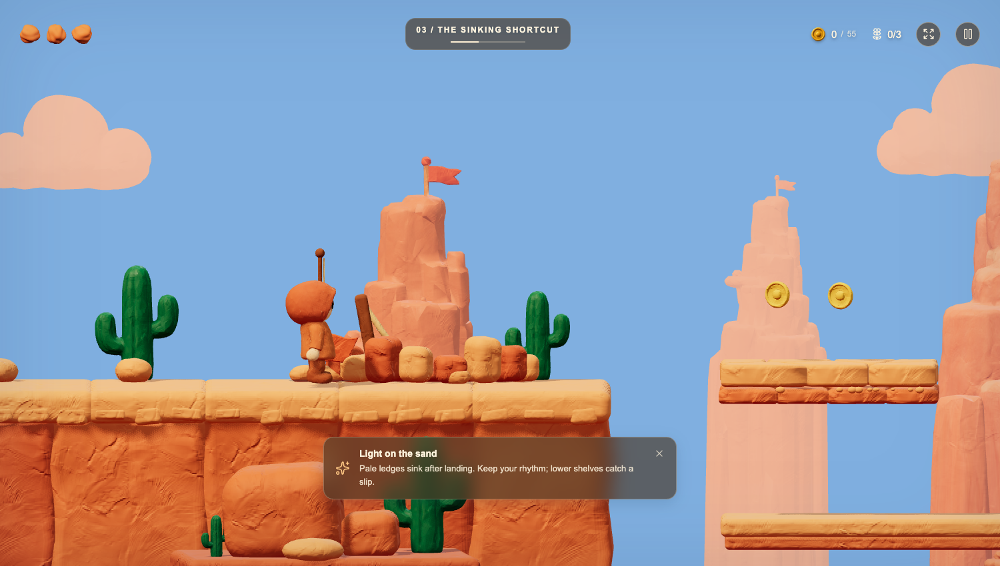

# Canyon, cavern and city storytelling

Implemented 11 September 2026, following the [full playtest findings](../playtest-2026-09-11/PLAYTEST.md). The pass reduces repeated landmark silhouettes and adds small signs of everyday life to the Hanging Quarter. Gameplay routes, collisions, collectibles and mechanism timing are unchanged.

## Specific changes

| Location | Design choice | Before / after |
|---|---|---|
| Canyon skyline | Alternate broad arches with eroded stacks; vary summit height, position and orientation. Reduce distant arch frequency. | [Before](before-great-arch.png) · [After](after-great-arch.png) |
| Sinking Shortcut, x93 | Replace the third repeated windmill with a broken sandstone basin, fallen stones and a weathered post. Retain the two functional windmill landmarks. | [Before](before-sinking-shortcut.png) · [After](after-sinking-shortcut.png) |
| Furnace Ferry, x62–103 | Use fewer spiral grotto silhouettes, varied recess depths and warm mushroom dressing. The exit has three small cooling vessels. | [Before](before-furnace-ferry.png) · [After](after-furnace-ferry.png) |
| Turning Heart, x118 | An old circular bearing introduces the room's mechanical character; nearby mushrooms provide a warm accent. | [Before](before-turning-heart.png) · [After](after-turning-heart.png) |
| Sunken Relay, x168 | Replace the repeated crystal monument with a low sample display and measuring staff; leave more open space around the route. | [Before](before-sunken-relay.png) · [After](after-sunken-relay.png) |
| Spitter Gallery, x226 | Use a small rounded geode arch with pale interior stones, separating it from the survey and machinery rooms. | [Before](before-spitter-gallery.png) · [After](after-spitter-gallery.png) |
| Laundry Switchbacks, x120 | A single generated laundry nook makes the section name visible in the world. Its base sits on the rear of the existing roof. | [Before](before-laundry-switchbacks.png) · [After](after-laundry-switchbacks.png) |
| Rooftop homes, including x168 | Two dark window recesses with cream sills beneath selected homes suggest occupied rooms. | [Before](before-city-windows.png) · [After](after-city-windows.png) |
| Gondola Exchange, x183 | Replace a decorative counterweight frame with a compact ropework shelf, two spools and a crate. | [Before](before-ropeyard.png) · [After](after-ropeyard.png) |
| Bell Court, x243 | Replace the decorative bell gateway with a bench and two muted green herb pots. The animated goal bell remains distinctive. | [Before](before-bell-court.png) · [After](after-bell-court.png) |

The cave also has short echo pillars at Spark Balcony and smaller bearing/sample arrangements on upper balconies. Narrow balconies use shallow props; scenery stays behind the hero and moves or streams with its supporting platform.





## New asset and provenance

- Reference created with the **built-in image_gen tool**, using the existing Laundry Switchbacks screenshot for style. [Exact prompt](../../assets/landmark-storytelling/reference-prompt.txt) · [Reference image](../../assets/landmark-storytelling/laundry-reference.png).
- Tripo image-to-model, P1, task `28d8fddb-ba3a-40fd-b865-c35ac048c99e`: **50 credits consumed**. [Job receipt](tripo-result.json) · [Source GLB and preview](../../assets/landmark-storytelling/tripo-out/laundry-reference-28d8fddb/).
- [Shipped GLB](../../dist/assets/city-laundry.glb): **5,996 triangles, 625,172 bytes (611 KiB)**, three embedded 1024 × 1024 material maps. Texture repacking preserves geometry and UV buffers. [Hashes and manifest](../../dist/assets/city-laundry.json).
- The runtime rotates the source to face the camera, normalizes it to 3.8 world units wide and grounds its plinth. Clones share retained geometry and materials. The model loads with the city chapter.

The other new arrangements use the game's existing clay geometry and palette.

To reproduce the model-generation and texture-preparation steps:

```sh
pnpm dlx tripo-cli@latest make assets/landmark-storytelling/laundry-reference.png -p face_limit=6000 -p texture_alignment=original_image -o assets/landmark-storytelling --json --yes
python scripts/prepare-city-laundry.py assets/landmark-storytelling/tripo-out/laundry-reference-28d8fddb/model.glb
```

The first command starts a new paid generation; its task ID and output directory will differ. Repacking the saved source requires only Pillow and NumPy.

## Verification

All **25 check groups pass** across the complete sweep and final scene recheck. The full sweep passed 24 groups and exposed a world-matrix issue in the new placement assertion; the final scene check updates world matrices before inspecting bounds and passes. Evidence: [full sweep](all-checks.txt) · [final scene checks](scene-checks.txt).

- All four main chapters complete in simulation, without resets or state edits; 211 main, optional and recovery crossings pass under game physics.
- Laundry width, grounding, triangle budget, retained resources, streaming away/back, editor rebuilds and unchanged level data pass.
- New cave/city arrangements fit the rear of their supporting platforms, including narrow balconies.
- Live Chrome/WebGL inspection covers 11 landscape compositions plus a [portrait laundry view](after-laundry-portrait.png), with matching before captures. [After results](after-results.json): no page errors or failed HTTP asset requests.

These new screenshots are fixed composition samples, positioned by the review harness. They are separate from the complete input-driven playthrough captured in the earlier playtest. Render counters are snapshots, not a performance benchmark.

Run the game on port 5173, then use `node scripts/review-landmarks.cjs` to refresh the after captures. `BEFORE=1` substitutes the six archived pre-change rendering modules from `baseline-sources.json.gz`; other modules use the current working tree. Set `PLAYWRIGHT_MODULE` and `CHROME_PATH` when using different local runtimes.

Primary implementation: [canyon](../../dist/canyon.js), [cavern](../../dist/cavern.js), [story arrangements](../../dist/story-landmarks.js), [laundry loader](../../dist/city-laundry.js), [setpieces](../../dist/setpieces.js), [city terrain](../../dist/citadel.js).
